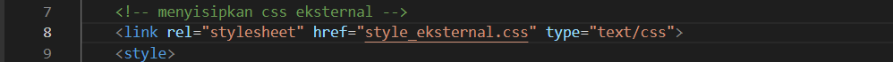

# Labs2
## Membuat Dokumen HTML
ini adalah tampilannya 

Selanjutnya buka pada brwoser untuk melihat hasilnya.

## Mendeklarasikan CSS Internal
Kemudian tambahkan deklarasi CSS internal seperti berikut pada bagian head dokumen. ini adalah tampilannya 

Selanjutnya simpan perubahan yang ada, dan lakukan refresh pada browser untuk melihat hasilnya.

## Menambahkan Inline CSS
Kemudian tambahkan deklarasi inline CSS pada tag `
` seperti berikut.

Simpan kembali dan refresh kembali browser untuk melihat perubahannya.

## Membuat CSS Eksternal
Buatlah file baru dengan nama style_eksternal.css kemudian buatlah deklarasi CSS seperti berikut.

Kemudian tambahkan tag `<link>` untuk merujuk file css yang sudah dibuat pada bagian `<head>`

Selanjutnya refresh kembali browser untuk melihat perubahannya.
ini adalah tampilan Ekternal CSS

## Menambahkan CSS Selector
Selanjutnya menambahkan CSS Selector menggunakan ID dan Class Selector. Pada file style_eksternal.css, tambahkan kode berikut.

Kemudian simpan kembali dan refresh browser untuk melihat perubahannya.
ini adalah tampilan CSS ID dan Class Selector
